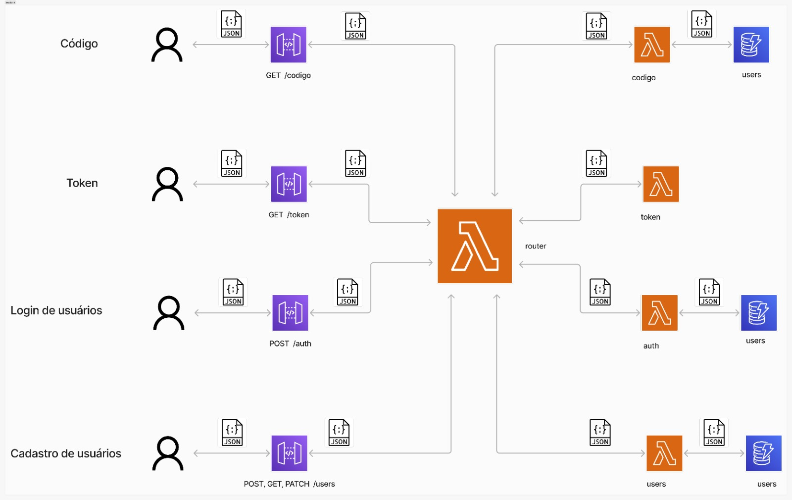

# Portfólio de Aprendizado com AWS e Lambda

Bem-vindo ao meu portfólio de aprendizado, onde compartilho o desenvolvimento e a implementação de várias funções Lambda utilizando a Amazon Web Services (AWS). Este repositório serve como um registro do meu progresso e das habilidades adquiridas na construção de aplicações serverless, explorando a flexibilidade e eficiência que a computação sem servidor pode oferecer.

## Introdução

Este projeto começou como uma iniciativa pessoal para explorar as capacidades do AWS Lambda e outros serviços associados. A computação serverless representa uma mudança de paradigma, permitindo aos desenvolvedores focarem mais na lógica de negócio e menos na infraestrutura. O objetivo principal deste portfólio é demonstrar como diferentes componentes de uma aplicação moderna podem ser implementados utilizando funções Lambda, integrando-se perfeitamente com outros serviços da AWS.

## Arquitetura do Projeto

O sistema é composto por diversas funções Lambda, cada uma dedicada a uma funcionalidade específica da aplicação. Essas funções são orquestradas para criar um sistema coeso e eficiente. Abaixo estão as principais funções e suas responsabilidades:

### Router

A função `Router` atua como um ponto de entrada centralizado para todas as solicitações HTTP. Ela determina a rota apropriada com base no caminho (`path`) e no método HTTP (`httpMethod`) da solicitação, encaminhando-a para a função Lambda correspondente. Isso facilita a separação de responsabilidades e mantém o código organizado e modular.

- **Encaminhamento de Solicitações**: Redireciona solicitações para funções Lambda específicas, como `authFunction`, `usersFunction`, `tokenFunction`, `aiFunction`, e `codigoFunction`.
- **Verificação de Caminho e Método HTTP**: Assegura que as solicitações sejam tratadas pela função correta, baseada no endpoint e no tipo de solicitação.
- **Logs para Depuração**: Gera logs detalhados para auxiliar na resolução de problemas e no monitoramento da aplicação.

### Login

A função `Login` é responsável pela autenticação dos usuários. Ela verifica as credenciais fornecidas e, se válidas, gera um token JWT que é usado para autenticar o usuário em futuras interações com o sistema.

- **Verificação de Credenciais**: Valida o nome de usuário e a senha contra os registros armazenados.
- **Geração de Tokens JWT**: Cria tokens seguros que representam a sessão do usuário, facilitando o acesso a recursos protegidos.
- **Manutenção de Sessões**: Gerencia o ciclo de vida das sessões de usuário, incluindo expiração e renovação de tokens.

### Token

A função `Token` lida com a validação de tokens JWT. Esta função é crucial para garantir que apenas usuários autenticados possam acessar recursos protegidos da aplicação.

- **Validação de Token**: Verifica a integridade e validade dos tokens JWT, garantindo que não tenham sido alterados ou expirado.
- **Autorização de Acesso**: Assegura que os usuários possuam as permissões necessárias para acessar determinados recursos ou executar ações específicas.

### Users

A função `Users` gerencia todos os aspectos relacionados ao usuário, incluindo cadastro, consulta, e atualização de informações.

- **Cadastro de Usuários**: Permite que novos usuários se registrem na plataforma, armazenando informações de forma segura.
- **Consulta e Atualização**: Fornece endpoints para recuperar e modificar dados de usuário, garantindo que informações sensíveis sejam tratadas adequadamente.
- **Gerenciamento de Senhas**: Implementa práticas de segurança como hashing de senhas, utilizando algoritmos como bcrypt.

### Recuperação-Login

A função `Recuperação-Login` facilita a recuperação de acesso para usuários que esqueceram suas credenciais. Ela envia códigos de verificação por e-mail para permitir a redefinição segura de senhas.

- **Envio de Códigos de Verificação**: Utiliza o Amazon SES para enviar códigos de recuperação aos e-mails registrados dos usuários.
- **Validação de Códigos**: Verifica se o código fornecido é válido e, se for, permite a redefinição da senha.

## Funções Adicionais

Além das funções principais, o sistema inclui funcionalidades suplementares para melhorar a experiência do usuário e a eficiência do sistema.

### Maritaca-AI

A função `maritaca-ai` é projetada para responder perguntas utilizando tecnologias de inteligência artificial. Ela usa modelos de Processamento de Linguagem Natural (PLN) para entender e gerar respostas para consultas dos usuários.

- **Processamento de Linguagem Natural**: Utiliza modelos treinados para interpretar consultas em linguagem natural e gerar respostas precisas.
- **Integração com Serviços de IA**: Pode integrar-se com serviços como Amazon Comprehend ou APIs de terceiros para análises mais profundas e precisas.
- **Capacidade de Escalabilidade**: Capaz de lidar com um grande volume de consultas simultâneas, garantindo tempos de resposta rápidos.

### Uploads

A função `uploads` é responsável pelo gerenciamento de uploads de arquivos para o sistema, assegurando que eles sejam armazenados e processados de maneira eficiente.

- **Recepção e Armazenamento**: Recebe arquivos dos usuários e os armazena no Amazon S3.
- **Validação de Arquivos**: Verifica o tipo e o tamanho dos arquivos para garantir que atendam aos requisitos do sistema.
- **Processamento Adicional**: Pode incluir etapas como conversão de formatos ou extração de dados, dependendo das necessidades do sistema.
- **Gerenciamento de Logs e Notificações**: Mantém registros detalhados das atividades de upload e notifica os administradores ou usuários em caso de erros ou eventos importantes.

## Diagramas de Arquitetura

Para uma visão mais clara de como essas funções interagem entre si e com outros serviços da AWS, o diagrama de arquitetura abaixo ilustra os fluxos de dados e a integração dos componentes:

## Recursos Utilizados

### AWS Lambda

O serviço de AWS Lambda é a espinha dorsal deste projeto, permitindo a execução de código em resposta a eventos e facilitando uma arquitetura de microservices. A capacidade de escalar automaticamente com base na demanda garante que o sistema possa lidar com picos de tráfego sem intervenção manual.

### Amazon DynamoDB

DynamoDB, o serviço de banco de dados NoSQL da AWS, é utilizado para armazenamento de dados de usuários e outros metadados. A escolha do DynamoDB se deve à sua capacidade de oferecer leitura e escrita de baixa latência, além de ser altamente escalável.

### Amazon SES (Simple Email Service)

Amazon SES é usado para envio de e-mails transacionais, como códigos de recuperação de senha e confirmações de cadastro. Este serviço é essencial para garantir a comunicação confiável e segura com os usuários.

### Segurança e Autenticação

A segurança é uma prioridade, com a implementação de autenticação baseada em JWT e a aplicação de criptografia para armazenamento de senhas. O uso de práticas recomendadas para segurança de dados e gerenciamento de acessos assegura a proteção dos dados dos usuários.

## Aprendizados

Ao longo do desenvolvimento deste projeto, obtive conhecimentos valiosos em diversas áreas:

- **Computação Serverless**: Aprendi a criar e gerenciar funções Lambda, otimizando a arquitetura para desempenho e custo.
- **Modelagem de Dados NoSQL**: Desenvolvi habilidades em modelagem e consulta de dados em DynamoDB, compreendendo as nuances do design orientado a acesso.
- **Autenticação e Segurança**: Implementei autenticação segura com JWT e práticas de armazenamento seguro de senhas.
- **Comunicação com SES**: Aprendi a configurar e utilizar Amazon SES para envio eficiente de e-mails.

## Como Usar

### Configuração Inicial

Para começar, é necessário configurar suas credenciais da AWS e ajustar as variáveis de configuração do projeto, como chaves secretas, nomes de tabelas DynamoDB, e endereços de e-mail.

### Deploy

As funções Lambda e outros recursos podem ser implantados utilizando o AWS CLI ou o AWS Management Console. Detalhes específicos de deploy estão disponíveis em subdiretórios correspondentes no repositório.

## Contribuições

Contribuições e sugestões são sempre bem-vindas. Se você encontrar algum problema ou tiver ideias para melhorias, sinta-se à vontade para abrir issues ou enviar pull requests. Este projeto é tanto um portfólio de aprendizado quanto um ponto de partida para futuras melhorias e expansões.

